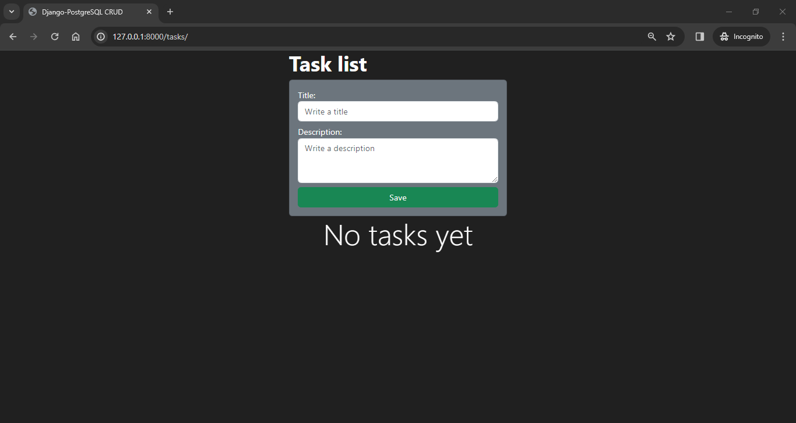
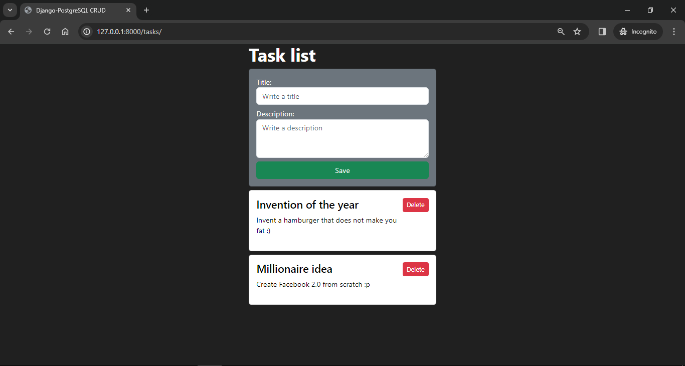

# Django-PostgreSQL-CRUD

## Introduction

This project was made using virtualenv (Python module to manage virtual environments), Python 3.11.1 and PostgreSQL 16.

To create a new virtual environment using this module, try to run the next command on your terminal:

```bash
$ <project_relative_path>virtualenv venv
```

After that, install the requirements that will be found in a text file. Feel free to use other Python modules to manage virtual environments. :)

```bash
$ pip install -r requirements.txt
```

Requirements was generated with the command:

```bash
$ pip freeze > requirements.txt
```

## How does this work?

You only need to open the project and redirect yourself through the path to the next Project path: /tasks/  

## Used commands

```bash
$ django-admin startproject <project_name> . # To create a new django project
```

```bash
$ python manage.py startapp <app_name> # To create a new django app 
```

```bash
$ python manage.py runserver # To run the project
```

## Database connection

It's necessary to create an empty database called "tasksdb" in PostgreSQL. Having the database created, run:

```bash
$ python manage.py makemigrations
```

And then:

```bash
$ python manage.py migrate
```

## Captures

No tasks



With some tasks



## Note

This project was based on [Fazt Code](https://youtu.be/_zNZ1lK6RTA?si=DTVvVIK4b0m69P5v), a greate YouTube channel related to Programming. :)
